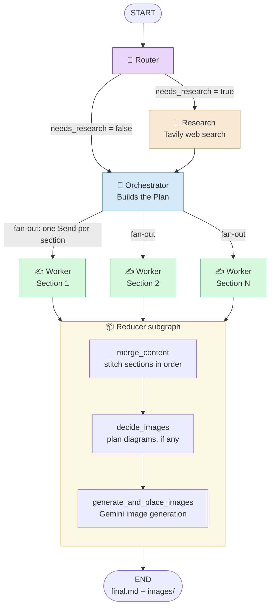
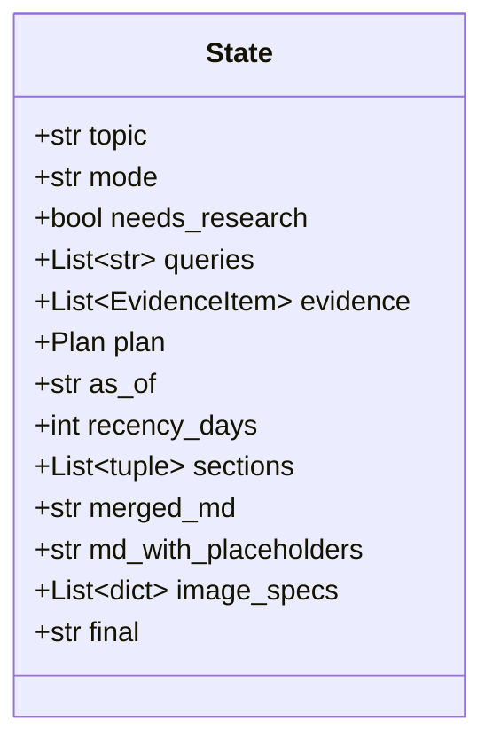
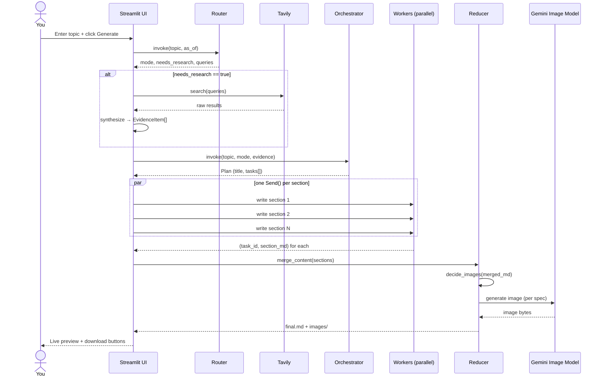

<div align="center">

# 📝 Blog Writing Agent

**A multi-agent AI system that researches, plans, writes, and illustrates full technical blog posts — end to end.**

Built with **LangGraph** · **Google Gemini** · **Tavily** · **Streamlit**


🎉 **This is my first Agentic AI project** — built to learn how autonomous, multi-step, tool-using agents are designed and orchestrated.

</div>

---

## 📚 Table of contents

- [What it does](#-what-it-does)
- [Why "agentic"?](#-why-agentic)
- [Architecture](#-architecture)
- [Request lifecycle](#-request-lifecycle-sequence-diagram)
- [Project structure](#️-project-structure)
- [Tech stack](#️-tech-stack)
- [Getting started](#-getting-started)
- [Using the UI](#️-using-the-ui)
- [Example run](#-example-run)
- [Free-tier survival guide](#-free-tier-survival-guide)
- [Design decisions & lessons learned](#-design-decisions--lessons-learned)
- [Troubleshooting](#-troubleshooting)
- [Roadmap](#-roadmap)
- [License](#-license)

---

## ✨ What it does

Give it a topic. It:

1. 🧭 **Decides** if the topic needs fresh web research or can rely on evergreen knowledge.
2. 🔎 **Researches** the web (if needed) and turns raw search results into clean, dated, citable evidence.
3. 🧩 **Plans** a full outline — title, audience, tone, and 5–9 sections, each with a goal and bullet points.
4. ✍️ **Writes every section in parallel**, in independent worker agents, each grounded in the plan and (if applicable) the evidence.
5. 📦 **Merges** all sections into one coherent post, in the right order.
6. 🖼️ **Decides if diagrams help**, and if so, **generates and places** them using Gemini's image model.
7. 🖥️ **Serves it all** in a Streamlit app with a live preview, source list, image gallery, and one-click downloads.

---

## 🤔 Why "agentic"?

A classic LLM call is one prompt → one response. This project is **agentic** because it's a system of specialized steps that:

- **Makes decisions about its own process** (the Router deciding *whether* to research at all).
- **Uses tools autonomously** (the Research step calling Tavily's search API without a human in the loop).
- **Delegates work to parallel sub-agents** (the Orchestrator spinning up one Worker per section).
- **Reduces/merges results back together** (the Reducer stitching sections and deciding on visuals).

That's the core idea behind frameworks like LangGraph: model each step as a **node**, model the handoffs as **edges**, and let a **graph** — not a single prompt — drive the behavior.

---

## 🧠 Architecture

The whole system is one LangGraph `StateGraph`. The `worker` step fans out into one parallel branch per section, and the `reducer` step is itself a sub-graph.



### Stage-by-stage

| Stage | Role | Output type |
|---|---|---|
| **Router** | Picks `closed_book` / `hybrid` / `open_book` mode; decides if research is needed and what to search for. | Structured (`RouterDecision`) |
| **Research** | Runs Tavily searches, synthesizes raw results into clean `EvidenceItem`s, filters by recency window. | Structured (`EvidencePack`) |
| **Orchestrator** | Produces the full `Plan`: title, audience, tone, blog kind, and every `Task` (section) with goals/bullets/word targets. | Structured (`Plan`) |
| **Fan-out** | Pure Python — splits the plan into one `Send()` per section so workers run **in parallel**, no LLM call. | — |
| **Worker** | Writes ONE section in Markdown, following its goal/bullets, citing evidence when the mode requires it. | Free text |
| **Reducer → merge_content** | Sorts and stitches all sections into one ordered document. | — |
| **Reducer → decide_images** | Decides if diagrams would help (max 3), inserts placeholders, writes image prompts. | Structured (`GlobalImagePlan`) |
| **Reducer → generate_and_place_images** | Calls Gemini's image model per planned image, saves to `images/`, swaps placeholders for real images. | Image bytes |

### Shared state

Every node reads from and writes to one shared `State` object:



`sections` is declared as `Annotated[List[tuple[int, str]], operator.add]` — this tells LangGraph to **automatically append** every parallel worker's output instead of one overwriting another. This is the mechanism that makes fan-out/fan-in safe.

---

## ⏱ Request lifecycle (sequence diagram)

What actually happens, in order, for one click of **🚀 Generate Blog**:



---

## 🗂️ Project structure

```
blog-writing-agent/
├── bwa_backend.py         # LangGraph agent: router, research, orchestrator, worker, reducer
├── bwa_frontend.py        # Streamlit UI that imports and drives the compiled graph
├── images/                 # Auto-generated diagrams land here
├── *.md                    # Every generated blog is saved here, ready to publish
├── .env                     # Your API keys (never commit this)
├── requirements.txt        # Pinnable dependency list
└── README.md
```

---

## 🛠️ Tech stack

| Layer | Tool | Why |
|---|---|---|
| Agent orchestration | [LangGraph](https://github.com/langchain-ai/langgraph) | Graph-based control flow, native fan-out/fan-in, structured state |
| LLM (text) | Google Gemini `gemini-2.5-flash-lite` via `langchain-google-genai` | Generous free-tier daily quota, fast, strong structured-output support |
| LLM (images) | Gemini `gemini-2.5-flash-image` | Same provider/key as text, keeps setup simple |
| Web research | [Tavily Search API](https://tavily.com) | Purpose-built search API for LLM agents, clean JSON results |
| Structured outputs | Pydantic v2 (`Plan`, `Task`, `EvidenceItem`, `ImageSpec`, ...) | Type-safe, validated agent outputs instead of fragile text parsing |
| Frontend | [Streamlit](https://streamlit.io) | Fast to build, good for tool-heavy prototypes |
| Config | `python-dotenv` | Keeps API keys out of source code |

---

## 🚀 Getting started

### 1. Clone and set up a virtual environment (recommended)

```bash
git clone <your-repo-url>
cd blog-writing-agent
python -m venv venv
venv\Scripts\activate        # Windows
# source venv/bin/activate   # macOS/Linux
```

### 2. Install dependencies

```bash
pip install langgraph langchain-google-genai langchain-core langchain-community \
            pydantic python-dotenv streamlit pandas tavily-python google-genai
```

Or, if you keep a `requirements.txt`:

```bash
pip install -r requirements.txt
```

### 3. Add your API keys

Create a `.env` file in the project root:

```env
GOOGLE_API_KEY=your_google_gemini_api_key
TAVILY_API_KEY=your_tavily_api_key
```

- Get a free Gemini key at [aistudio.google.com/apikey](https://aistudio.google.com/apikey).
- Get a free Tavily key at [tavily.com](https://tavily.com).

> 💡 Research and images are both optional per run. No `TAVILY_API_KEY`? The agent just skips research and defaults to `closed_book` mode.

### 4. Run it

```bash
streamlit run bwa_frontend.py
```

Opens at `http://localhost:8501`. Enter a topic, pick an as-of date, click **🚀 Generate Blog**.

---

## 🖥️ Using the UI

| Tab | What you'll see |
|---|---|
| 🧩 **Plan** | The outline — title, audience, tone, and a table of every section with word targets and requirements. |
| 🔎 **Evidence** | Every source the research step pulled in: title, URL, publish date. |
| 📝 **Markdown Preview** | The finished post, rendered live with inline images, plus download buttons (`.md` or a `.zip` bundle with images). |
| 🖼️ **Images** | Every generated image with its prompt/caption, and a zip download. |
| 🧾 **Logs** | Raw step-by-step trace of the graph run — useful for debugging. |

The sidebar also lists every blog you've generated before (any `*.md` in the project folder), so you can reload and re-download old posts anytime.

---

## 🔍 Example run

```
Topic: "State of Multimodal LLMs in 2026"
As-of: 2026-08-24
```

**Router** → `mode = hybrid`, needs_research = true
**Research** → 8 queries → 14 deduplicated, recency-filtered sources
**Orchestrator** → 7-section plan: intro, architecture shifts, benchmark landscape, notable releases, tooling ecosystem, limitations, outlook
**Workers** → 7 sections written in parallel, 3 of them citing evidence URLs
**Reducer** → merged into one post, 2 diagrams planned and generated (architecture comparison + timeline)
**Output** → `state_of_multimodal_llms_in_2026.md` + `images/` folder, ready to publish

---

## ⚙️ Free-tier survival guide

This project defaults to `gemini-2.5-flash-lite` because it has a far more generous free daily quota than heavier models. Even so:

- **One run ≈ 6–10+ LLM calls**: router + research (optional) + orchestrator + one worker *per section* + image planning + image generation.
- **`429 RESOURCE_EXHAUSTED`** means you've hit Gemini's free-tier daily cap. It resets at **midnight Pacific Time** (~12:30 PM IST) — switching to a different Google account/project does **not** reset it, since the quota is tracked per account.
- **Tavily** also has a monthly search cap on its free tier — avoid rapid repeated research runs while testing.
- If you need to stress-test the pipeline without burning quota, temporarily hardcode a fake `Plan`/`sections` in `State` and only test the reducer/image steps.

---

## 🧩 Design decisions & lessons learned

- **Fan-out/fan-in with `Send()`**: instead of writing sections sequentially, the plan is split into independent `Send("worker", ...)` calls so LangGraph runs them concurrently — merged automatically via the `operator.add` reducer on `sections`.
- **Structured outputs over text parsing**: every planning/decision step uses `.with_structured_output(PydanticModel)`, so the agent's outputs are type-safe and validated instead of regex-parsed free text.
- **Grounding rules baked into prompts**: in `open_book`/`hybrid` mode, workers are explicitly told to only cite provided evidence URLs and to say *"Not found in provided sources"* rather than invent facts.
- **Graceful degradation**: if image generation fails (quota/safety/API change), the pipeline doesn't crash — it swaps in a visible fallback note in the Markdown and continues.
- **Backend/frontend separation**: `bwa_backend.py` has zero UI code — it's a pure, reusable LangGraph app. `bwa_frontend.py` only imports and drives it, so the agent could be reused behind a CLI or API later with no changes to the agent itself.
- **`response.text` over `response.content`**: LangChain's `.content` can return a list of content blocks (not a plain string) depending on the model/provider. `.text` reliably concatenates just the text blocks into a string — a subtle but important gotcha when switching between models/providers.

---

## 🩹 Troubleshooting

| Symptom | Cause | Fix |
|---|---|---|
| `AttributeError: 'list' object has no attribute 'strip'` | `response.content` returned a list of content blocks, not a string | Use `response.text.strip()` instead of `response.content.strip()` |
| `ValidationError ... Did not find tavily_api_key` | `TAVILY_API_KEY` missing from environment | Add it to `.env`, ensure `load_dotenv()` runs before the key is read |
| `ValidationError ... API key required for Gemini Developer API` | `GOOGLE_API_KEY` not visible to the Python environment running Streamlit | Confirm `.env` is in the same folder you run `streamlit run` from, and that `python-dotenv` is installed in *that* Python environment (check for multiple Python installs) |
| `429 RESOURCE_EXHAUSTED` (per-minute) | Too many calls in a short window | Add retry/backoff: `llm.with_retry(stop_after_attempt=5, wait_exponential_jitter=True)` |
| `429 RESOURCE_EXHAUSTED` (per-day) | Daily free-tier cap hit for that model | Switch to a lighter model (e.g. `gemini-2.5-flash-lite`) or wait for the daily reset |
| `ValueError: Found edge starting at unknown node 'x'` | An edge references a node name that was never registered with `add_node(...)` | Make sure every node name used in `add_edge`/`add_conditional_edges` has a matching `add_node` call |
| `NameError: name 'x' is not defined` | A function referenced in `add_node` was never defined (or the cell defining it wasn't run) | Define/import the function before building the graph, and re-run cells top to bottom after edits |

---

## 🔭 Roadmap

- [ ] CLI entry point (`python bwa_backend.py "topic"`) alongside the Streamlit UI
- [ ] Checkpointing (e.g. `langgraph.checkpoint.sqlite`) for resumable, long-running runs
- [ ] Built-in retry/backoff wrapper around all LLM calls
- [ ] Direct export to Medium / Dev.to / Notion via their APIs
- [ ] "Regenerate this section only" control in the UI
- [ ] Swap Tavily for a pluggable search-provider interface

---

## 📄 License

This project is for learning purposes. Add a license of your choice if you plan to share or open-source it — [MIT](https://choosealicense.com/licenses/mit/) is a common, permissive default for personal projects.

---

<div align="center">

Built while learning agentic AI, one bug at a time. 🐛→🚀

</div>
